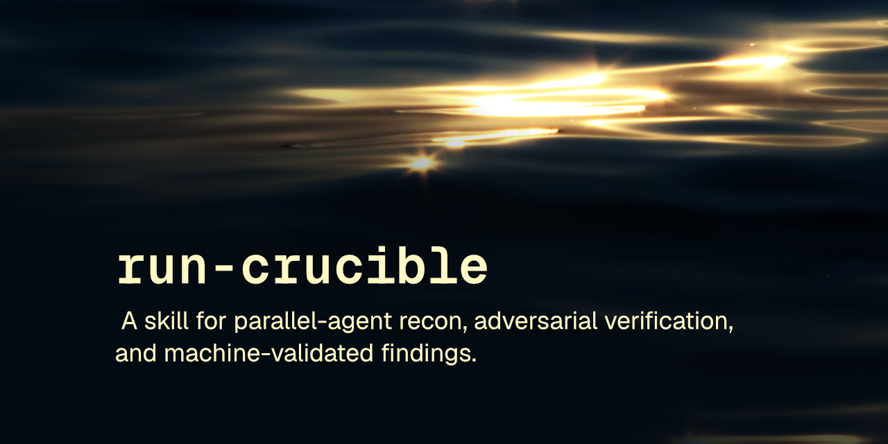

<p align="center"></p>

# crucible

Audit skill: recon, then adversarial check, then verified findings only. No false positives survive.

[](LICENSE) [](https://skills.sh/robcsaszar/crucible)

A targeted codebase audit skill: parallel domain recon agents, adversarial false-positive elimination, machine-validated findings JSON, and a SPEC handoff for implementation.

These skills follow the [Agent Skills specification](https://agentskills.io/specification) so they can be used by any skills-compatible agent.

## Installation

### npx skills

```
npx skills add robcsaszar/crucible
```

### Marketplace

```
/plugin marketplace add robcsaszar/crucible
/plugin install robcsaszar-crucible@crucible
```

### Manually

Copy the `skills/` directory into your project's `.claude/skills/`.

## Skill

`crucible` runs a structured, multi-phase audit of a codebase: parallel recon agents investigate the domains you name, an independent adversarial pass confirms, downgrades, or rejects each finding, a prioritized plan is synthesized, P1/P2 findings get an independent verification pass against current source, and the result is written out as a `SPEC.md` ready to hand to an implementation step. Use it when auditing a user flow, investigating cross-domain issues, or running a structured fix cycle.

## Safety

`crucible` ships a findings validator script. Read [SAFETY.md](SAFETY.md) for what it does.

## License

[MIT](LICENSE) © Rob Csaszar
